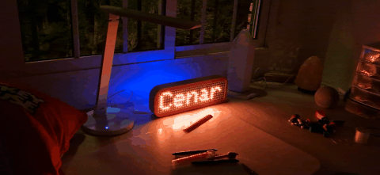

# Notifigram

ESP32-based LED matrix display that receives Telegram messages and shows them
with read confirmation. Configured via Bluetooth from an Android companion app.



📺 **Video walkthrough**: [Watch the build on YouTube](https://www.youtube.com/watch?v=WmuRWdu5Bt0) (Spanish, English auto-subs)

## What it does

Send a message to a Telegram bot from your phone. The ESP32 receives it, displays
it on a WS2812B 8x32 LED matrix (with your chosen effect), and sends back a
"✅ Leído" (Read) confirmation to the sender.

When idle, the matrix switches to a clean digital clock (HH:MM via NTP).
The screensaver delay is configurable from 5 seconds to 30 minutes, or off.

I built it as a way to send messages to my son without him needing a phone.
It sits on his desk and notifies him when needed.

## Features

- **13 text effects**: scroll, scroll-reverse, bounce, letter-by-letter,
  blink, zoom, fade, rainbow, wipe, shake, pulse, inverted, plain
- **15 named colors** controllable from Telegram (`/color_rojo`, `/color_oro`, etc.)
- **6 brightness levels** (min, low, night, medium, high, max)
- **NTP clock screensaver** with auto DST (Europe/Madrid by default)
- **Configurable screensaver delay**: 5s, 30s, 1m, 3m, 5m, 10m, 30m, or off
- **Dual mode**: Bluetooth (setup) + Wi-Fi (operation), switchable via `/btON`
- **Multi-user**: authorized chat IDs are auto-discovered and stored
- **Persistent config** in SPIFFS (`/config.json`)
- **Read receipt**: sender gets "✅ Leído" after the message is displayed
- **Anti-spam**: duplicate messages within 30s are ignored, duplicate sends within 5s are blocked
- **Auto-recovery**: if Wi-Fi or Bot connection fails, falls back to Bluetooth mode
- **Status command** (`/estado`): uptime, IP, mode, color, effect, firmware date

## Hardware

| Component        | Model / Spec                                        |
|------------------|-----------------------------------------------------|
| MCU              | ESP32-WROOM-32 DevKit                               |
| Display          | WS2812B LED matrix 8x32 (256 LEDs, ZIGZAG layout)   |
| Power supply     | 5V / 3A minimum                                     |
| Level shifter    | 74AHCT125 (optional but recommended for >1m of LEDs)|

## Wiring

| ESP32 pin | WS2812B    | Notes                                |
|-----------|------------|--------------------------------------|
| GPIO 13   | DIN        | Data line                            |
| GND       | GND        | Common ground (ESP32 + LEDs + PSU)   |
| —         | 5V         | From dedicated PSU, NOT from ESP32   |

> ⚠️ Do **not** power the LED matrix from the ESP32's 5V pin.
> 256 WS2812B LEDs at full white can draw ~15A. Use a dedicated 5V supply
> and tie all grounds together.

The matrix is configured as `NEO_MATRIX_TOP + NEO_MATRIX_LEFT +
NEO_MATRIX_COLUMNS + NEO_MATRIX_ZIGZAG`. If your panel has a different
internal layout, adjust this in `Notifigram.cpp`.

## Telegram commands

| Command        | Description                          |
|----------------|--------------------------------------|
| (any text)     | Display the message on the matrix    |
| `/color`       | List of 15 colors                    |
| `/color_<name>`| Change text color                    |
| `/brillo`      | List of brightness levels            |
| `/brillo_<lvl>`| Change brightness                    |
| `/efecto`      | List of 13 effects                   |
| `/efecto_<name>`| Change text effect                  |
| `/tiempo`      | Screensaver delay options            |
| `/tiempo_<val>`| Set screensaver delay (or off)       |
| `/estado`      | System status                        |
| `/btON`        | Switch to Bluetooth mode             |
| `/reset`       | Restart the device                   |
| `/help`        | Show command list                    |

## Software setup

1. Clone this repo
2. Open with PlatformIO (VS Code) or Arduino IDE
3. Install dependencies (auto-resolved by PlatformIO):
   - `Adafruit NeoPixel`
   - `Adafruit GFX`
   - `Adafruit NeoMatrix`
   - `ArduinoJson`
   - `UniversalTelegramBot`
4. Flash the firmware
5. On first boot, the device shows `Espera BT` and starts a Bluetooth
   server named `Notifigram`
6. Pair from the Android app and send a JSON like:
   `{"ssid":"...","pass":"...","token":"..."}`
7. The device saves the config to SPIFFS and reboots into Wi-Fi mode
8. Send any text to your bot — it shows on the matrix

## How it works

```
[Phone] --Telegram-- [Bot] <-- HTTPS poll (3s) -- [ESP32] -- WS2812B data --> [LED Matrix]
                                                     |
                                                     +-- "✅ Leído" --> [Bot] --> [Phone]
```

The firmware is structured as 6 modules:

- `main.cpp` — Arduino setup/loop
- `sistema.cpp` — boot sequence, Wi-Fi, NTP, bot init, fallback to BT on failure
- `bluetooth.cpp` — JSON config handler (GET / status / reset / config)
- `config.cpp` — load/save config to SPIFFS
- `telegram.cpp` — command parser and message dispatcher
- `pantalla.cpp` — text rendering with effects + NTP clock screensaver

## Telegram bot setup

1. Open [@BotFather](https://t.me/BotFather) on Telegram
2. Send `/newbot`, give it a name, get your token
3. Use that token in the Android app's setup screen
4. Send any message to your bot — your chat ID is auto-registered on first contact

## Known limitations and TODOs

- Telegram polling at 3s intervals is fine for personal use but not the most
  efficient method. Webhooks would require a public endpoint.
- `secureClient.setInsecure()` skips TLS certificate validation for Telegram.
  Functional but not production-grade. PR welcome.
- `delay()` calls inside command handlers block the loop for up to 5s while
  echoing color/effect/brightness changes.
- The Bluetooth config path overwrites global SSID/password/token in RAM before
  validation. SPIFFS keeps the previous good config, but a refactor is pending
  (parse into temporaries, validate, then assign). See TODO in `bluetooth.cpp`.
- SPIFFS storage is not encrypted; physical access to the ESP32 flash would
  reveal the saved Wi-Fi password and bot token.

## Project status

This is a personal maker project. It works reliably on my desk, but the code
is not production-grade. PRs, issues, and suggestions are welcome.

## License

MIT

## Author

Toni Hernández — [YouTube](https://www.youtube.com/@Toni_Hdez)
